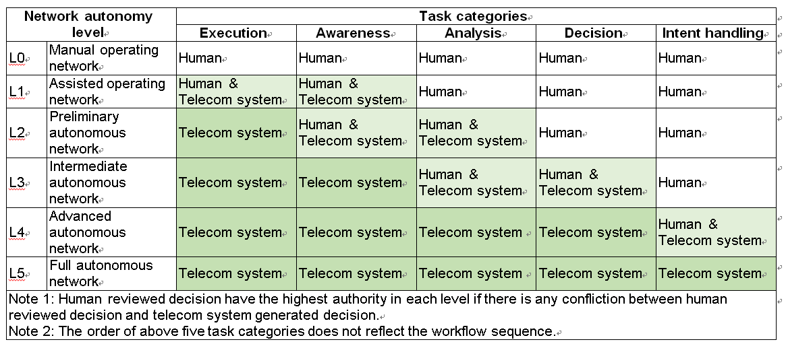
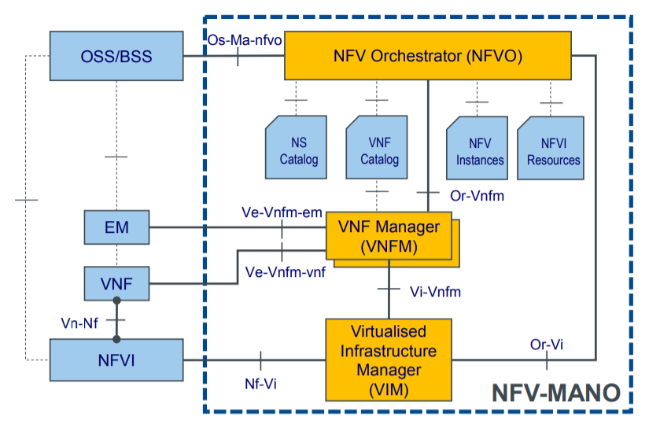

# 28_SeriesのTSサマリ

モバNW 長谷川哲哉

## 目的

28_Series関連のTSのサマリをまとめた資料。

<https://www.3gpp.org/DynaReport/28-series.htm>

Stage 1（要求事項の規定）  
Stage 2（アーキテクチャの規定）  
Stage 3（プロトコルの規定）

|28.| 概要| メモ |
|---|---|---|
|[100](#ts-28100) |Autonomous networkのレベル（ANL）、要件。|ANLがメジャーになったら参照するとよい。 |
|[104](#ts-28104) |Management Data Analytics (MDA)。まだ中身無し。|状況ウォッチ。 |
|[310](#ts-28310) |Energy efficiencyのKPI、UC、ソリューション。|SON、ESを実装する場合に見る。 |
|500|省略 | 省略|
|510|省略 | 省略|
|515|省略 | 省略|
|520|省略 | 省略|
|525|省略 | 省略|
|[525](#ts-28525)|VNFのLCM Stage1。NSのスケーリング、SW更新、各種IFへの要求事項とユースケース。 |ほぼ包含+SQもある526を見たほうがよい。 | 
|[526](#ts-28526)|VNFのプロシージャー。VNF/NS/NSD/PNFDの作成、スケーリング、状態変化通知、パッケージの管理。 | IEはETSI GS NFV-IFA008, 011, 013を参照となっている。VNFベースのLCMはCNFに最適でない場合もある。| 
|[527](#ts-28527)|VNFのLCM Stage2。IM(Information Model)とIF Os-Ma-nfvo(OSS-NFVO間)、Ve-Vnfm-em(EM-VNFM間)。 | 詳細はETSI GS NFV-IFA008を参照となっている。|
|[528](#ts-28528)|VNFのLCM Stage3。IM(Information Model)とIF Os-Ma-nfvo(OSS-NFVO間)、Ve-Vnfm-em(EM-VNFM間)のプロシージャー、データモデル。   | 詳細はETSI GS NFV-SOL 002(Ve-Vnfm-em), 005(Os-Ma-nfvo)を参照となっている。|

<https://www.etsi.org/standards-search>
<https://portal.etsi.org/tb.aspx?TBID=831&subTB=831#/>

|NFV| # | 内容 |
|---|---|---|
|　|001|ユースケース|
|　|003|略語|
|EVE|Evolution and Ecosystem ||
|　|011||
|IFA|Interfaces and Architecture ||
|　|008|Ve-VnfmのIF, IM|
|　|011|VNFDとパッケージ|
|　|013|Os-Ma-nfvoのIF、IM|
|NOC|Network Operators Council ||
|REL|Reliability & Availability ||
|SEC|Security ||
|SOL|Solutions |プロトコルとデータモデル|
|　|004 |VNF Package関連のデータモデル|
|　|010 |VNF Packageのフォーマット|
|　|014 |仮想化リソースのYAML|
|　|015 |NFV-MANO APIのテンプレート|

## もくじ
<!-- @import "[TOC]" {cmd="toc" depthFrom=1 depthTo=6 orderedList=false} -->
<!-- code_chunk_output -->

- [28_SeriesのTSサマリ](#28_seriesのtsサマリ)
  - [目的](#目的)
  - [もくじ](#もくじ)
  - [TS 28.100](#ts-28100)
    - [概要](#概要)
    - [メモ](#メモ)
  - [TS 28.104](#ts-28104)
    - [概要](#概要-1)
    - [メモ](#メモ-1)
  - [TS 28.310](#ts-28310)
    - [概要](#概要-2)
    - [メモ](#メモ-2)
  - [TS 28.525](#ts-28525)
    - [概要](#概要-3)
    - [メモ](#メモ-3)
  - [TS 28.526](#ts-28526)
    - [概要](#概要-4)
    - [メモ](#メモ-4)
  - [TS 28.527](#ts-28527)
    - [概要](#概要-5)
    - [メモ](#メモ-5)
  - [TS 28.528](#ts-28528)
    - [概要](#概要-6)
    - [メモ](#メモ-6)

<!-- /code_chunk_output -->

<div style="page-break-before:always"></div>

## TS 28.100

- V0.4.0

### 概要

Autonomous networkのレベル（ANL）、要件を規定する。

- AON : Autonomous Network
- ANL : Autonomous Network Level

ワークフローは以下のカテゴリで構成され、カテゴリ中にタスクが含まれる。

- Intent handling
オペレーターの意図を詳細なオペレーションに変換し、以下のタスクに渡す。
- Awareness
ネットワークの情報を収集し、必要なデータの前処理を行う。
- Analysis
取得したネットワーク情報を分析して意思決定のためのリコメンドをする。
- Desision
オペレーションを実行する。

下記のテンプレートを用いて各ユースケース毎に自動化レベルを定義する。



例えば、6.2.1 Autonomous network level for RAN NE deploymentの場合、ワークフローにはタスクA～タスクHがあり、どこまで自動化できるかによってANLが決まる。

### メモ

自動車の自動運転レベルのようにANLが認知されれば準拠する必要がある。

<div style="page-break-before:always"></div>

## TS 28.104

- V0.0.0

### 概要

Management Data Analytics (MDA)に関する規定。

### メモ

まだ中身なし。

<div style="page-break-before:always"></div>


## TS 28.310

- V17.0.0

### 概要

5GのEnergy efficiencyに関する規定。KPI、UC、ソリューションが書かれている。

6.2.2 Centralized energy saving solutionの例を示す。関連するPM、MOI、プロシージャーが規定されている。

```plantuml
title Centralized energy saving activation Diagram

participant "MnS producer of Centralized ES" as MnSProdCSON
participant "Performance Assurance MnS producer" as MnSProdPA
participant "Provisioning MnS producer" as MnSProdProv
participant "NR Capacity Booster Cell" as NRCapacityBCell
participant "NR Cells" as NRCandidateCells

MnSProdPA <- NRCapacityBCell: 1. Collects traffic load performance measurements
MnSProdPA <- NRCandidateCells: 1. Collects traffic load performance measurements

MnSProdPA -> MnSProdCSON: 2. Collects traffic load performance measurements
note over MnSProdCSON: Analyzes traffic load performance measurements

opt if decision is taken that the NR capacity booster cell should enter the energySaving state
MnSProdCSON -> MnSProdProv: 3. <i>modifyMOIAttributes</i> (NR Capacity Booster Cell, (energySaving, old value = 'off', new value = 'on'))
MnSProdProv -> NRCapacityBCell: 4. Configures NR Capacity Booster Cell
note over NRCapacityBCell: 5. May initiate handover actions
MnSProdProv -> NRCandidateCells: 6. Configures Candidate Cells
note over NRCapacityBCell: 7. Enters energySaving state
NRCapacityBCell -> MnSProdProv: 8. Informs that energySaving state has changed
MnSProdProv -> MnSProdCSON: 9. <i>notifyMOIAttributeValueChanges</i> (NR Capacity Booster Cell, (energySaving, old value = 'off', new value = 'on'))
end
```

事前に関連するMOIが作成されている。MnSプロデューサーはブースターセル、候補セルからトラフィック負荷PMを収集する。MnSプロデューサーはブスターセルのEnergySaving StateをmodifyMOIAttributesに変更する。ブースターセルは在圏UEをHOする。notifyMOIAttributeValueChangesを送信してもよい。

### メモ

EnergySavingを実装する場合は参考にするとよい。

<div style="page-break-before:always"></div>

## TS 28.525

- V16.0.0

### 概要

VNFのLCM Stage 1。VNF、NSのスケーリング、SW更新、各種IFへの要求事項とユースケース。

- NS（Network Service; VNFの上位概念。複数VNF、PNFで実現するサービス）
- VNF（Virtualized Network Function; 仮想化されたNF）
- VNFC（(VNFC Component; VNFのコンポーネント）
- NFVO（NFV Orchestrator; NSのオーケストレーション）
- VNFM（VNF Manager; VNFのオーケストレーション）
- NSD（NS Descriptor; NSのテンプレート）
- PNFD（Physical Network Function Descriptor; PNFのテンプレート）
- VIM（Virtualized Infrastructure Managed; NFVIの管理）

VNFのSW更新には2パターンある。

1. 更新するSWがVNFパッケージに含まれない場合
5.4.4.2	VNF application software update when application software is not part of VNF Package  
NMがEMにSW更新の要求を送信し、SW更新する。

2. 更新するSWがVNFパッケージに含まれる場合
5.4.4.3	VNF application software update when application software is part of VNF Package
NMがEMにSW更新の要求を送信し、SW更新する。NMはNFVOにインスタンス情報（最新のVNFパッケージ情報を含む）の更新を要求する。

### メモ

UCは図がないので526を見たほうがよい。

<div style="page-break-before:always"></div>

## TS 28.526

- V16.0.0

### 概要

VNFのプロシージャー。VNF/NS/NSD/PNFDの作成、スケーリング、状態変化通知、パッケージの管理。

### メモ

IEはETSI GS NFV-IFA008, 011, 013を参照となっている。VNFベースのLCMはCNFに最適でない場合もある。

<div style="page-break-before:always"></div>

## TS 28.527

- V16.0.0

### 概要

VNFのLCM Stage2。IM(Information Model)とIF Os-Ma-nfvo(OSS-NFVO間)、Ve-Vnfm-em(EM-VNFM間)。



### メモ

詳細はETSI GS NFV-IFA008を参照となっている。

<div style="page-break-before:always"></div>


## TS 28.528

- V16.0.0

### 概要

VNFのLCM Stage3。IM(Information Model)とIF Os-Ma-nfvo(OSS-NFVO間)、Ve-Vnfm-em(EM-VNFM間)のプロシージャー、データモデル。  

Os-Ma-nfvoの下記の項目のプロシージャー、API、データモデルはETSI GS NFV-SOL 005で規定される。

- NSD management
- NS lifecycle management
- NS lifecycle change notification
- VNF package management

Ve-Vnfm-emの下記の項目のプロシージャー、API、データモデルはETSI GS NFV-SOL 002で規定される。

- VNF lifecycle management

### メモ

詳細はETSI GS NFV-SOL 002, 005を参照となっている。

<div style="page-break-before:always"></div>